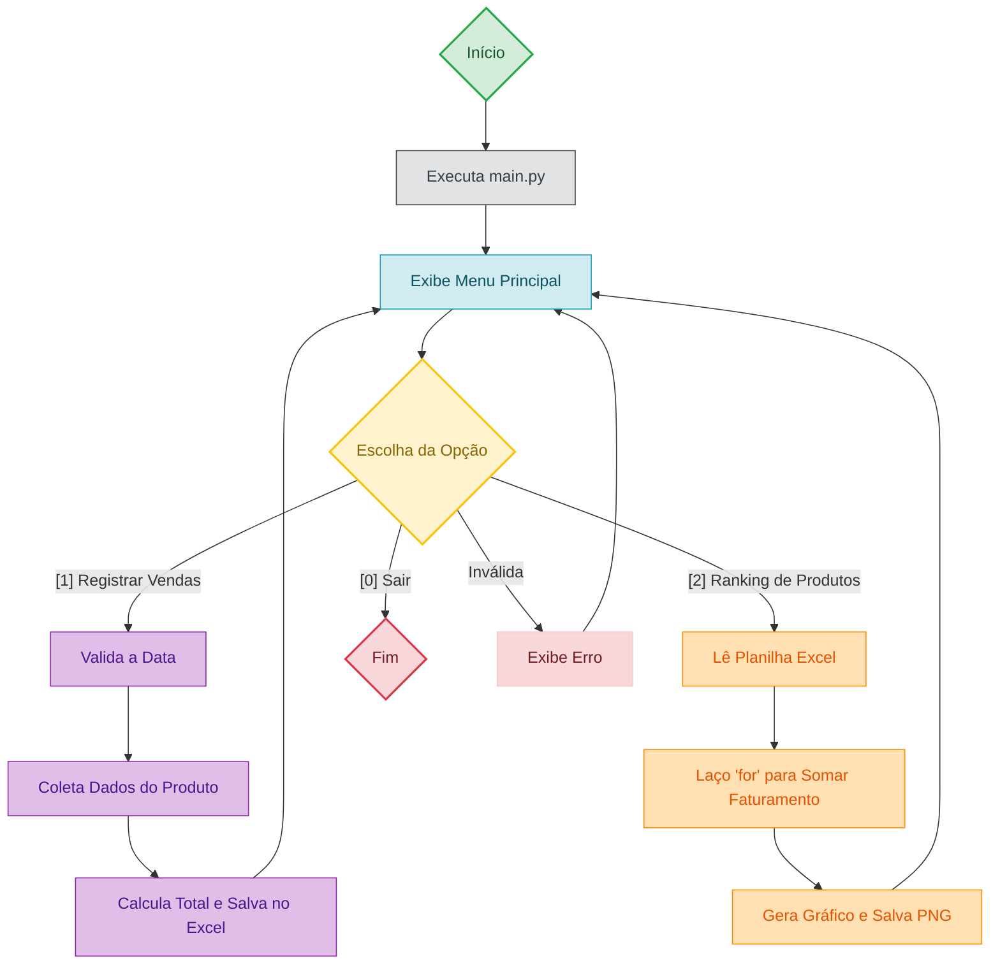

```mermaid
---
config:
  layout: fixed
---
flowchart TB
    n1([Início]) --> n2[Executa main.py]
    n2 --> n3[Exibe Menu Principal]
    n3 --> n4{Escolha da Opção}
    
    n4 -->|"[1] Registrar Vendas"| n5[Valida a Data]
    n5 --> n6[Coleta Dados do Produto]
    n6 --> n7[Calcula Total e Salva no Excel]
    n7 --> n3
    
    n4 -->|"[2] Ranking de Produtos"| n8[Lê Planilha Excel]
    n8 --> n9[Laço 'for' para Somar Faturamento]
    n9 --> n10[Gera Gráfico e Salva PNG]
    n10 --> n3
    
    n4 -->|"[0] Sair"| n12([Fim])
    
    n4 -->|"Inválida"| n13[Exibe Erro]
    n13 --> n3

    n1@{ shape: diam}
    n12@{ shape: diam}

    %% Cores para destacar as seções
    style n1 fill:#d4edda,stroke:#28a745,stroke-width:2px,color:#155724
    style n12 fill:#f8d7da,stroke:#dc3545,stroke-width:2px,color:#721c24
    style n2 fill:#e2e3e5,stroke:#383d41,stroke-width:1px,color:#383d41
    style n3 fill:#d1ecf1,stroke:#17a2b8,stroke-width:1px,color:#0c5460
    style n4 fill:#fff3cd,stroke:#ffc107,stroke-width:2px,color:#856404
    
    %% Bloco de Registro (Lilás)
    style n5 fill:#e1bee7,stroke:#8e24aa,stroke-width:1px,color:#4a148c
    style n6 fill:#e1bee7,stroke:#8e24aa,stroke-width:1px,color:#4a148c
    style n7 fill:#e1bee7,stroke:#8e24aa,stroke-width:1px,color:#4a148c
    
    %% Bloco de Relatório/Ranking (Laranja/Amarelo claro)
    style n8 fill:#ffe0b2,stroke:#fb8c00,stroke-width:1px,color:#e65100
    style n9 fill:#ffe0b2,stroke:#fb8c00,stroke-width:1px,color:#e65100
    style n10 fill:#ffe0b2,stroke:#fb8c00,stroke-width:1px,color:#e65100
    
    style n13 fill:#f8d7da,stroke:#f5c6cb,stroke-width:1px,color:#721c24
```